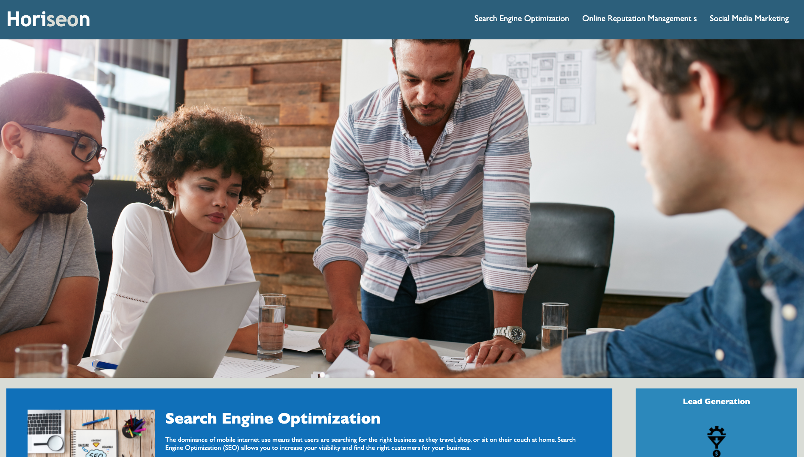

# Code Refactor Bootcamp Project - Challenge 1
Simple static page and code refactor project using HTML and CSS. 

## Table of contents
* [General info](#general-info)
* [Technologies](#technologies)
* [Launch](#launch)
* [FYIs: User Story, Acceptance Criteria, and Grading Requirements] (#FYIs)

## General info
This project is the first assignment from the full stack coding bootcamp program at UNC Chapel Hill. The assignment began with starter code, and we were instructed to refactor the code based on a user story, acceptance criteria, and grading requirements. Main refactors and skills demonstrated included: ensuring links were functional, consolidating CSS, and using semantic HTML. 

    
## Technologies
Project is created with:
* HTML
* CSS
    
## Launch
To launch this site, click here

## FYIs

### User Story
AS A marketing agency
I WANT a codebase that follows accessibility standards
SO THAT our own site is optimized for search engines

### Acceptance Criteria

GIVEN a webpage meets accessibility standards

WHEN I view the source code

THEN I find semantic HTML elements

WHEN I view the structure of the HTML elements

THEN I find that the elements follow a logical structure independent of styling and positioning

WHEN I view the image elements

THEN I find accessible alt attributes

WHEN I view the heading attributes

THEN they fall in sequential order

WHEN I view the title element

THEN I find a concise, descriptive title

###Grading Requirements

This challenge is graded based on the following criteria:

**Technical Acceptance Criteria: 40%**

*Satisfies all of the preceding acceptance criteria plus the following code improvements:*

* Application's links all function correctly.
* Application's CSS selectors and properties are consolidated and organized to follow semantic structure.
* Application's CSS file is properly commented.

**Deployment: 32%**

* Application deployed at live URL.
* Application loads with no errors.
* Application GitHub URL submitted.
* GitHub repository that contains application code.

**Application Quality: 15%**

* Application resembles (at least 90%) screenshots provided in challenge instructions.

**Repository Quality: 13%**

* Repository has a unique name.
* Repository follows best practices for file structure and naming conventions.
* Repository follows best practices for class/id naming conventions, indentation, quality comments, etc.
* Repository contains multiple descriptive commit messages.
* Repository contains quality README file with description, screenshot, and link to deployed application.

